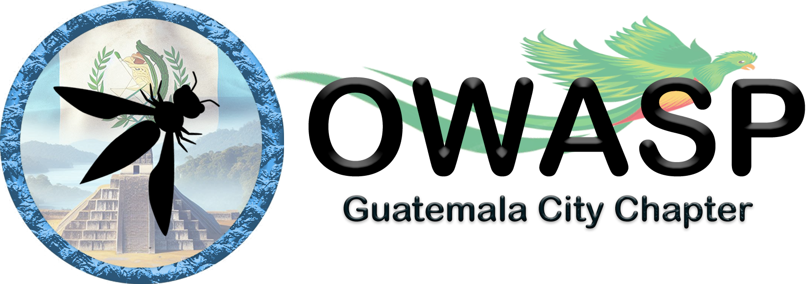

---

layout: col-sidebar
title: OWASP Guatemala City
tags: chapter-Guatemala-city
country: Guatemala
city: Guatemala
region: Central America
level: 4
site_side: true
altfooter: true
---

## Bienvenido
El Capítulo de OWASP en Guatemala tiene como meta principal promover un entorno colaborativo y proactivo en el campo de la seguridad informática y ciberseguridad. Nuestra principal misión es estimular la educación, concienciación e investigación en estos campos, incentivando la participación de profesionales, académicos y aficionados. Mediante la organización de eventos, conferencias, talleres y proyectos de investigación y desarrollo, buscamos fortalecer la comunidad de seguridad informática en Guatemala.

## Participación

OWASP, una organización benéfica que está comprometida con la mejora de la seguridad del software en todo el mundo. Todos sus proyectos, herramientas, documentos, foros y capítulos están disponibles de forma gratuita y abierta para cualquier persona interesada en fortalecer la ciberseguridad.

Los Capítulos de OWASP son liderados por individuos locales de acuerdo con la [Política de los Capítulos](/www-policy/operational/chapters). Las contribuciones financieras deben realizarse únicamente a través de canales autorizados y siguiendo los procedimientos establecidos.

En OWASP, damos la bienvenida y alentamos la participación de todos en nuestros [proyectos](/projects/), [Capítulos Locales](/chapters/) y [Eventos](/events/). Ponemos un gran énfasis en la diversidad en todas nuestras iniciativas. OWASP ofrece una plataforma excepcional para aprender sobre ciberseguridad, redes y para desarrollar una reputación como experto en el campo. También te invitamos a unirte como [miembro](/membership/) o realizar [donativos](/donate/) para apoyar nuestro trabajo. ¡Únete a nuestra comunidad y contribuye a hacer la web más segura para todos!

## Próximos meetings 

Nuestros meetings son abiertos al público en general.

#### - Reconocimiento Facial: Un enfoque de seguridad
*Jueves 16 de mayo de 2024* se tendrá una charla sobre: [Reconocimiento Facial: Un enfoque de seguridad](), donde abordaremos conceptos generales sobre la biometría y reconocimiento facial:
- Cómo funcionan.
- Aspectos Seguridad y cómo la evaluamos adecuadamente.
- Retos para este tipo de tecnología.

**Ponente:** *Carlos Ganoza*, Especialista en InfoSec e Ingeniería de software con más de 12 años de experiencia en el mercado internacional. Actualmente Lidera la estrategia de ciberseguridad de una importante institución financiera del Perú y es Chapter Leader del capítulo de OWASP Lima.
  
#### - SCA en Acción: navegando por las dependencias de Software
Se tendrá una charla sobre: [SCA en Acción: navegando por las dependencias de Software](), donde abordaremos conceptos generales sobre el análisis e integración de dependencias en el software, tocando puntos como:
- Riesgos de dependencias de software
- Estrategias de gestión de dependencias
- Implementación de SCA en el ciclo de vida del desarrollo de software
> [!NOTE]
> Este Webinar se estará programando en los primeros días de Junio 2024.
