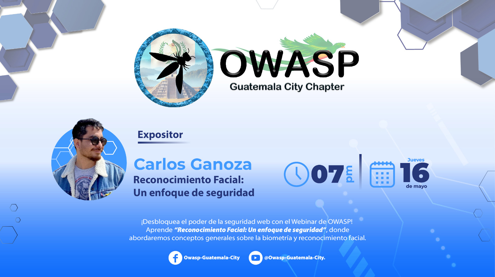

---

title: PrevEvents
displaytext: Eventos Anteriores
layout: null
tab: true
order: 4
tags: Guatemala

---

## Eventos Anteriores OWASP Guatemala-City

*Miercoles 24 de abril de 2024* se celebró nuestro primer CHAPTER MEETING. [La importancia de la protección de los datos sensible en las API's](https://www.youtube.com/watch?v=qOrb8wLTzsM&t=48s). Donde se trataron temas como:
- Principales amenazas en la seguridad de una API.
- Breve introducción al OWASP API Top 10.
- Buenas prácticas de seguridad minimas en las API.
- Estándares de cumplimientos de protección de datos relacionados
- Encriptación de los datos sensibles en las API's.

*Jueves 16 de mayo de 2024* se realizó nuestra segunda charla con el tema: [Reconocimiento Facial: Un enfoque de seguridad](https://www.youtube.com/watch?v=XsV0sGT4iXY), donde abordamos conceptos generales sobre la biometría y reconocimiento facial:
- Cómo funcionan.
- Aspectos Seguridad y cómo la evaluamos adecuadamente.
- Retos para este tipo de tecnología.

*Ponente: Carlos Ganoza*, Especialista en InfoSec e Ingeniería de software con más de 12 años de experiencia en el mercado internacional. Actualmente Lidera la estrategia de ciberseguridad de una importante institución financiera del Perú y es Chapter Leader del capítulo de OWASP Lima.

