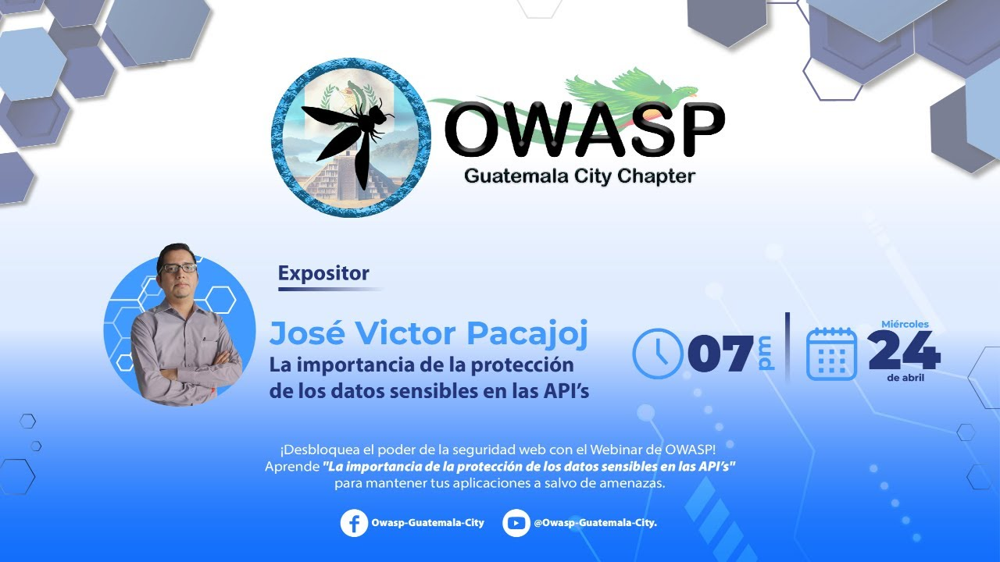

---

title: PrevEvents
displaytext: Eventos Anteriores
layout: null
tab: true
order: 4
tags: Guatemala

---

## Eventos Anteriores OWASP Guatemala-City

*Miercoles 24 de abril de 2024* se celebró nuestro primer CHAPTER MEETING. [La importancia de la protección de los datos sensible en las API's](https://www.youtube.com/watch?v=qOrb8wLTzsM&t=48s). Donde se trataron temas como:
- Principales amenazas en la seguridad de una API.
- Breve introducción al OWASP API Top 10.
- Buenas prácticas de seguridad minimas en las API.
- Estándares de cumplimientos de protección de datos relacionados
- Encriptación de los datos sensibles en las API's.

